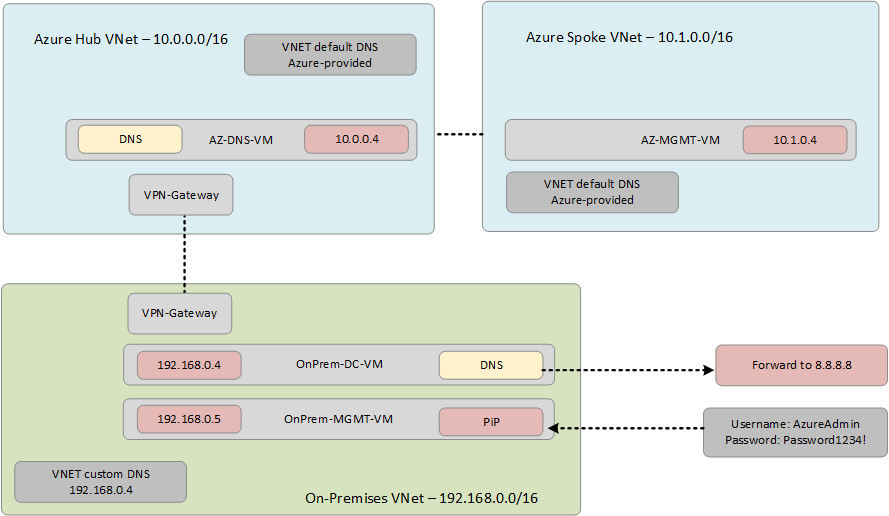

# **Azure Private Link DNS MicroHack**

# Contents //update this last//

[Lab Overview and Pre-req](#lab-overview)

[Challenge 1 : Connect to Azure SQL](#challenge-1--deploying-the-sap-s4-hana-landscape)

[Challenge 2 : Deploy service endpoints](#challenge-2--sap-parameter-tuning)

[Challenge 3 : Deploy private endpoint for SQL](#challenge-3--sap-hana-backup-using-azure-native-tools)

[Challenge 4 : Implement Azure DNS Private Zones integration](#challenge-4--securing-fiori-access-from-internet)

[Challenge 5 : Implement custom DNS integration (Windows DNS on Windows Server 2019)](#challenge-5--setup-dashboards-for-the-sap-environment)

[Challenge 6 : Implement On-Premises access using conditional forwarding](#challenge-6--hana-performance-validation)

[Challenge 7 : Optional, hard! Implement On-Premises access within using existing Azure hosted custom DNS server](#challenge-6--hana-performance-validation)

[Appendix](#appendix)

# Scenario

Contoso group is a consumer electrical retail company. The company works within a regulated industry and would like to secure their use of Azure PaaS services. As part of the evaluation the IT team has started to look at using Azure Private Link. Due to technical reasons this was put on hold and they have turned to Microsoft for support.

## Context

Different types of customer DNS. Link to Daniels work on accessing DNS landscape within a customer and top 5 questions to ask.

# Pre-requisites

## Overview

In order to use the MicroHack time most effectively, the following tasks should be completed prior to starting the session.

With the above pre-requisites in place, this will allow us to focus on building the differentiated knowledge in PrivateLink that the field requires, rather than spending hours repeating simple tasks such as setting up Virtual Networks and Virtual Machines. After complete these steps, the base lab build looks as follows:

## Task 1 : Deploy Template

Deploy the  environment using the Terraform template <tbc> . 

The template requires following inputs:

1. **location** - Choose your favourite Azure Region
4. **adminpassword** - Password for logging in to the Windows jumpbox (remember to create a strong password)

Rest of the variable values are picked up from terraform.tfvars file automatically

**Additional information**

To start the terraform deployment, follow the steps listed below

- Login to Azure cloud shell [https://shell.azure.com/](https://shell.azure.com/)
- Clone the GitHub repository 

`git clone https://github.com/carlsyner/Private-Endpoint-Hack-Template.git`

- Go to the new folder Private-Endpoint-Hack and initialize the terraform modules and download the azurerm resource provider

`terraform init`

- Now run apply to start the deployment (When prompted, confirm with a **yes** to start the deployment)

`terraform apply`

- Wait for the deployment to complete. This will take around 30 minutes (the VPN gateways take the longest to setup).

## Task 2 : Explore all the deployed resources

- Verify you can access the On-Premises Virtual Machine via RDP to the Public IP using the following credentials

Username: AzureAdmin

Password: Password1234!

- Verify that you are able to hop from the jumpbox to all Virtual Machines, using their Private IP addresses and RDP access. This also proves that the Site-to-site VPN is online

### :point_right: Hint 

**Desktop shortcuts exist for easy RDP access to other machines**

## :checkered_flag: Results

- You have deployed a basic Azure and On-Premises environment using a Terraform template
- You have become familiar with the components you have deployed in your subscripiton
- You are now be able to login to all VMs using the supplied credentials
- On-Premises VMs can contact Azure VMs

# Challenge 1 : Connect to Azure SQL

### Goal 

The goal of this exercise is to use the already existing image to deploy the SAP environment. Below is the High availability architecture for S/4 HANA which you need to deploy.

## Task 1 : Deploy an Azure SQL Server

Within the resource group named PaaS, deploy a simple Azure SQL Server in the same region as your Virtual Machines. How do we connect to this database by default, what networking information is needed, where do we find this?

## Task 2:  Test default connectivity to Azure SQL

- How are you connecting?
- What IP address is this using? How would you test?
- What tools are available on the SQL database to lock this down?

- SQL Firewall
- Service Endpoints

## Challenge 2 : Implement service endpoints for SAL

### Goal

The goal of this challenge is to tune SUSE operating system to SAP recommendation with minimum administrative efforts and apply changes with almost zero downtime.

## Task 1: Tune SAP parameter with minimum administrative effort

You have found that the SAP HANA VMs are not tuned as per the SAP recommendations.  Some of the recommendations in SAP note # 2382421 are not applied.  In this challenge you need to tune the parameters as per this SAP note except `net.ipv4.tcp_timestamps` which needs to be set to 0 for Azure

### :point_right: Hint

In SLES there are couple of tools available to tune the OS for running SAP namely sapconf and saptune. Sapconf performs minimum standard changes whereas saptune can apply SAP notes individually or bunch of notes relevant to the solution like SAP HANA, NetWeaver etc. You can use the customize option of saptune to edit a parameter within the note and apply it.

## Task 2: Reboot VMs with least business outage 

 You need to ensure that these changes persist after reboot. Also confirm that the **HANA** failover works fine.

### :point_right: Hint 

This could be done in several ways. You will be using some of the below commands to do this task

`crm node standby <nodename>` - Make the node offline for the cluster

`crm node online <nodename>` - Make the node online for the cluster

`crm cluster stop` - Stopping the cluster service on the node where it is executed

`crm cluster start` - Starting the cluster service on the node where it is executed

`crm resource migrate <resource name>` - Migrate a resource from one node to another

`crm resource clear <resource name>` - Remove migration constraints from resources

`crm resource cleanup <resource name>` - Cleanup any previous errors in the cluster

## :checkered_flag: Results

- You have tuned the OS parameters as per SAP note easily using the right tools.
- You have tested the HANA HA setup and tested the user experience during failover.

 

# Challenge 3 : SAP HANA Backup using Azure native tools

### Goal

SAP HANA, like other database, offers the possibility to backup to files. In addition, it also offers a backup API, which allows third-party backup tools to integrate directly with SAP HANA. Products like Azure Backup service, or Commvault are using this proprietary interface to trigger SAP HANA database or redo log backups. SAP HANA offers a third possibility, HANA backup based on storage snapshots. The focus of this challenge is to configure **Azure Backup for SAP HANA**.
 

## Task 1 :  Prepare HANA VMs for Azure Backup

Contoso Group have asked you to prepare SAP HANA virtual machines for Azure Backup using BACKINT API.

You need to perform all pre-requisites and setup network connectivity to allow Azure Backup to connect to SAP HANA database as per this document.

[https://docs.microsoft.com/en-us/azure/backup/tutorial-backup-sap-hana-db](https://docs.microsoft.com/en-us/azure/backup/tutorial-backup-sap-hana-db)

### :point_right: Hint 

Your HANA database is running over a 2 node highly available cluster. For this hack **configure it only on the active node**. 

Also, you may need to register your HANA virtual machines to access SUSE repos and install package unixODBC, if not already installed.

Run following commands as root to install unixODBC

`zypper install unixODBC`

You will need to create SAP HANA HDBUSERSTORE Key named SYSTEM for user SYSTEM for password less authentication.

Run following commands as tstadm on HANA virtual machine

Syntax

`hdbuserstore -i SET <KEY> host:port <USERNAME> <PASSWORD>`

Test the connection using following command.

`hdbsql -U SYSTEM`

On the hdbsql prompt, type \s to check the status and ensure you can connect.

## Task 2 : Run backup for HANA using Azure Backup

Contoso Group have asked you to create a backup configuration to meet their requirements and to start the first backup right away.

Contoso deem it sufficient to take full backups once a week over the weekend, but want to optimize the cost and time required for backup and restore by using an optimized backup and retention policy. In the scenario where a restore becomes necessary, they want to be able to restore with no more than 20 minutes of loss of data.

Create an appropriate backup and retention policy and backup your SAP HANA database using Azure Backup.

### :point_right: Hint 

The key steps are - create a recovery services vault, configure backup, create a backup policy and backup.

[https://docs.microsoft.com/en-us/azure/backup/tutorial-backup-sap-hana-db#create-a-recovery-service-vault](https://docs.microsoft.com/en-us/azure/backup/tutorial-backup-sap-hana-db#create-a-recovery-service-vault)

## :checkered_flag: Results

- You have configured and run Azure backup for HANA database

  
# Challenge 4 : Securing Fiori access from internet

### Goal

Expose specific SAP endpoints to internet without adding public IPs to SAP VMs.

## Task : Make SAP Fiori launchpad accessible from Internet 

Contoso group wants to expose their SAP Fiori launchpad to internet. They would like to do this in a secure way without exposing any other parts of SAP.  Security team at Contoso wants proof that only Fiori launchpad can be accessed and any attempt to access other urls will result in error. 

URL for Fiori launchpad

http://hostname:port/sap/bc/ui2/flp

You can use Azure app gateway for this exercise. Below diagram explains how application gateway works. 

### :point_right: Hint 

- You will need an additional subnet within the existing VNET (by adding a new address space) for App gateway creation
- Activate SAP ports HTTP (8000) and HTTPS (8001) using transaction SMICM.
- Note that the FQDN for SAP hostname doesn't resolve within the jumpbox. Use the IP address or just the hostname. 
- SSL is not in scope for this lab. Disable HTTPS switch for Fiori launchpad by changing the properties of service **/sap/bc/ui2/flp** in SICF. Changes need to be made in the Logon data tab and Error Pages tab (System Configuration). 
- Pay attention to NSG rules necessary for Application Gateway and your networking setup

## :checkered_flag: Results

- You have now demonstrated how SAP endpoints can be securely published to internet with the help of Azure App gateway.

# Challenge 5 : Setup dashboards for the SAP environment

### Goal 

Use Azure monitor to check performance of the SAP environment and setup dashboards.

## Task : Setup Availability and Performance dashboard for SAP 

The IT leadership team has requested for an availability and performance dashboard for the SAP environment. The dashboard must contain key performance metrics and availability for all the SAP VMs that have been deployed. 

### :point_right: Hint 

 Use Azure monitor for this exercise. Check what metrics are collected by default. There are several ways to visualize log and metric data stored in Azure Monitor
 It is sufficient to setup monitoring dashboard using **any one** of the following methods.

- Workbooks
- Azure dashboard
- PowerBI dashboard
- Grafana dashboard

[https://docs.microsoft.com/en-us/azure/azure-monitor/visualizations](https://docs.microsoft.com/en-us/azure/azure-monitor/visualizations)

See example dashboards below

## :checkered_flag: Results

- You now have centralized dashboards reporting performance and availability of your SAP S/4 HANA.

# Challenge 6 : HANA performance validation

### Goal

The goal of this exercise is to validate the setup of HANA infrastrcture.

## Task :  Check HANA parameters and performance 

You want to ensure that the HANA infrastructure is setup correctly and is performing as expected without involving the testing and functional teams to run tests.

### :point_right: Hint  

Use HANA mini checks SQL to verify the parameters and metrics of HANA. See SAP note # 1999993 - How-To: Interpreting SAP HANA Mini Check results

To check if infrastructure is setup correctly use HWCCT or HCMT tool. Both the tools are downloaded and available in the directory `/hana/backup/HANA_perftools` of HANA node tst-hana-vm-0

Note that some of the metrics will fail as we are using smaller VMs without write accelerators for our test deployment.

## :checkered_flag: Results

- You now successfully verified that SAP HANA system is setup correctly for optimum performance.

# Appendix

### Generating SSH keypair

- Login to Azure cloud shell [https://shell.azure.com/](https://shell.azure.com/)
- Generate SSH keypair using the command `ssh-keygen` as shown in the screenshot below

  

- Use the public key (id_rsa.pub) for the deployment. 
- Download the private key to your desktop using the download button at the top. You will be using this file for logging into the linux VMs 

