# **Azure Private Link DNS MicroHack**

# Contents

[MicroHack introduction and context](#Scenario)

[Challenge 1 : Connect to Azure SQL](#challenge-1--connect-to-azure-sql)

[Challenge 2 : Implement Service Endpoints to restrict access to your Azure SQL Server](#challenge-2--implement-service-endpoints-to-restrict-access-to-your-azure-sql-server)

[Challenge 3 : Deploy a Private Endpoint to utilise Azure Private Link for access to Azure SQL](#challenge-3--deploy-a-private-endpoint-to-utilise-azure-private-link-for-access-to-azure-sql)

[Challenge 4 : Deny public access to Azure SQL Server](#challenge-4--deny-public-access-to-azure-sql-server)

[Challenge 5 : Work with a custom DNS server inside of Azure](#challenge-5--work-with-a-custom-dns-server-inside-of-azure)

[Challenge 6 : Use Private Link to access an Azure SQL database over a Private Hybrid Connection](#challenge-6--use-private-link-to-access-an-azure-sql-database-over-a-private-hybrid-connection)

[Challenge 7 : (Warning! Stretch Goal / Advanced) Use Private Link from On-Premises without a pre-existing DNS Server in Azure](#challenge-7--warning-stretch-goal--advanced-use-private-link-from-on-premises-without-a-pre-existing-dns-server-in-azure)

# Scenario

Contoso group is a consumer retail finance company. The organisation works within a regulated industry and would like to secure their use of Azure Platform-as-a-service (PaaS) products. As part of their ongoing evaluation of platform features, the IT team has started to look at using **Azure Private Link**. 

## Context

This MicroHack scenario walks through the use of Azure Private Link with a focus on the required changes needed for DNS. Specifically, this builds up to include working with an existing custom DNS infrastructure (I.e. a customer using their own Virtual Machines for Internal DNS Resolution). In this lab we use Microsoft DNS running on top of Microsoft Windows Server 2019, but your customer could be using another DNS solution such as BIND on Linux, or Infoblox. 

This lab is not a full explanation of Azure Private Link as a technology, please consider the following articles required pre-reading to build foundational knowledge.

aka.ms/whatisprivatelink - Introductory video on Private Link
aka.ms/whyprivatelink - High level white paper exploring the requirement for Private Link.

Optional (read this after completing this lab to take your learning even deeper!

aka.ms/privatelinkdns - Technical white paper introducing the DNS challenge when working with Private Link

# Pre-requisites

## Overview

In order to use the MicroHack time most effectively, the following tasks should be completed prior to starting the session.

With these pre-requisites in place, we can focus on building the differentiated knowledge in Private Link that is required when working with the product, rather than spending hours repeating relatively simple tasks such as setting up Virtual Networks and Virtual Machines. 

At the end of this section your base lab build looks as follows:

In summary:

- "On-Premises" environment simulated by Azure Virtual Network
- On-Premises contains a client/mgmt VM and a DNS Server VM
- On-Premises is connected to Azure via a Site-to-Site VPN
- Azure contains a simple Hub and Spoke topology, with a client/mgmt VM and DNS Server VM

## Task 1 : Deploy Template

We are going to use a predefined Terraform to deploy the base environment. It will be deployed in to your subscription, with resources running in the Azure West Europe region.

To start the terraform deployment, follow the steps listed below:

- Login to Azure cloud shell [https://shell.azure.com/](https://shell.azure.com/)
- Clone the following GitHub repository 

`git clone https://github.com/adstuart/script/azure-privatelink-dns-microhack.git`

- Go to the new folder ./privatelink-dns-microhack and initialize the terraform modules and download the azurerm resource provider

`terraform init`

- Now run apply to start the deployment (When prompted, confirm with a **yes** to start the deployment)

`terraform apply`

- Choose a suitable password to be used for your Virtual Machines administrator account (username: AzureAdmin)

- Wait for the deployment to complete. This will take around 30 minutes (the VPN gateways take a while).

## Task 2 : Explore and verify the deployed resources

- Verify you can access the On-Premises Virtual Machine via RDP to the Public IP using the following credentials

Username: AzureAdmin

Password: {as per above step}

- Verify that you can hop from the jumpbox to all Virtual Machines, using their Private IP addresses and RDP access. This step also proves that the Site-to-site VPN is online. 

### :point_right: Hint 

**Within the On-Premises MGMT Virtual Machine, desktop shortcuts exist for easy RDP access to other virtual machines**

## Task 3 : Install SQL Server Management Studio on client/mgmt Virtual Machines

- As part of this MicroHack you will SQL Server Management Studio installed on both the On-Premises client/mgmt VM and Azure client/mgmt VM. Please install this prior to the lab. https://www.microsoft.com/en-gb/sql-server/sql-server-downloads. Alternatively, a drive can be mapped to an Azure File Share to copy the SSMS-setup files. Run the MAPDrive script which can be found on the desktop of ONPREM-MGMT-VM. 

## :checkered_flag: Results

- You have deployed a basic Azure and On-Premises environment using a Terraform template
- You have become familiar with the components you have deployed in your subscription
- You are now be able to login to all VMs using the supplied credentials
- On-Premises VMs can contact Azure VMs
- You have installed the required software

Now that we have the base lab deployed, we can progress to the Private Link challenges!

# Challenge 1 : Connect to Azure SQL

### Goal 

The goal of this exercise is to deploy a simple Azure SQL Server and observe the default network behaviour when connecting to it. 

## Task 1 : Deploy an Azure SQL Server

Within the resource group named private-link-microhack-hub-rg, deploy a simple Azure SQL Server in the West Europe. Example config shown below.

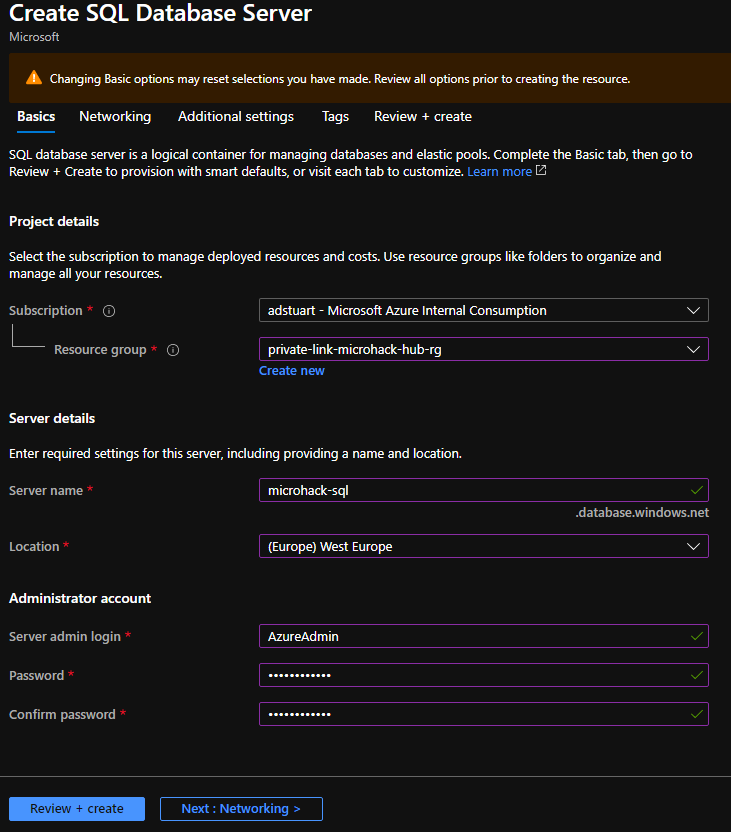

How do we connect to this SQL Server by default, what networking information is needed, where do we find this?

## Task 2:  Test default connectivity to Azure SQL

Using the FQDN obtained in the previous step, confirm that your Azure Management client/mgmt VM can establish a connection to your SQL Server. Launch SQL Server Management Studio (SSMS) and input your SQL Server details and credentials.

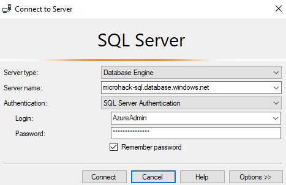

- Why does this connection fail?

## Task 3:  Modify SQL server firewall

- What settings on the Azure SQL server firewall do you need to modify?

- How can you verify which source Public IP address your Azure Management client/mgmt VM is using when accessing the Internet?

- How can you verify which destination Public IP is being used when connecting to your SQL Server FQDN?

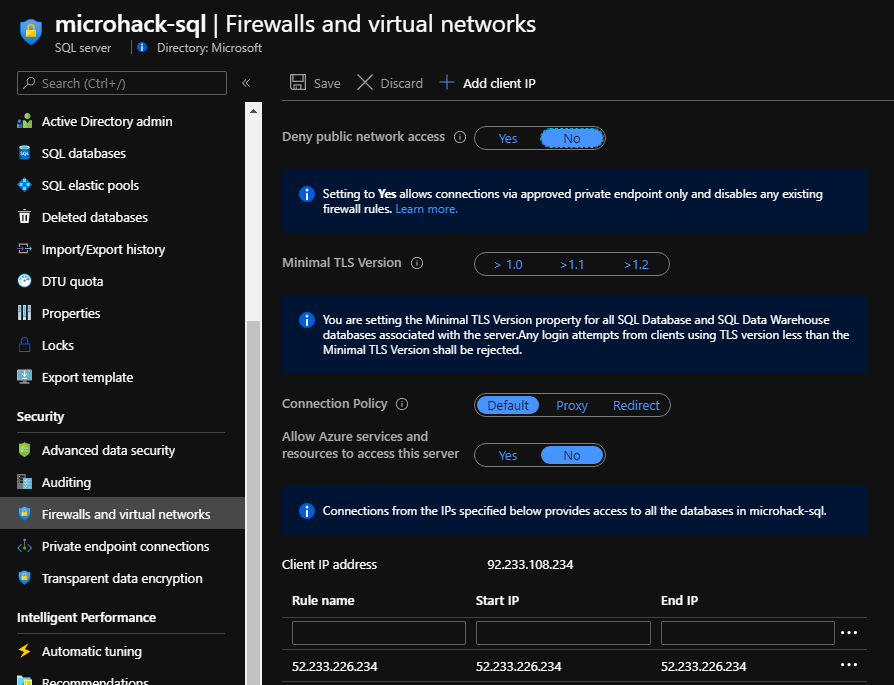

## :checkered_flag: Results

- You have deployed a basic Azure SQL Server, modified the default firewall settings, and connected to it from your Azure client/mgmt VM. You have confirmed that you are accessing it via the "Internet" (This traffic does not leave the Microsoft backbone, but it does use Public IP addresses). The traffic is sourced from the dynamic NAT address of your client/mgmt VM and is destined to a public IP address sitting in front of the Azure SQL Service. 

# Challenge 2 : Implement Service Endpoints to restrict access to your Azure SQL Server

### Goal

The goal of this challenge is to implement Service Endpoints to restrict access to your Azure SQL Server; turning off inbound connections from Public IPs (The Internet) and only allowing access from the subnet within which your Azure client/mgmt VM Resides.

Service Endpoints are often thought of as "generation 1" of secure access to PaaS services that do not benefit from VNet injection. It is good to revisit the behaviour or Service Endpoints to highlight the subtle benefits when working with Private Link.

## Task 1: Remove public IP address from SQL Server firewall

Within the previous step we added the public NAT IP address used by our client/mgmt VM to the SQL Server firewall. Please remove this IP address and save the firewall settings. This ensure that no inbound connections are permitted from any public IP address.

## Task 2: Enable Service Endpoints on your subnet

On your Infra subnet, within the Azure Spoke VNet, enable Service Endpoints for Azure.SQL. 

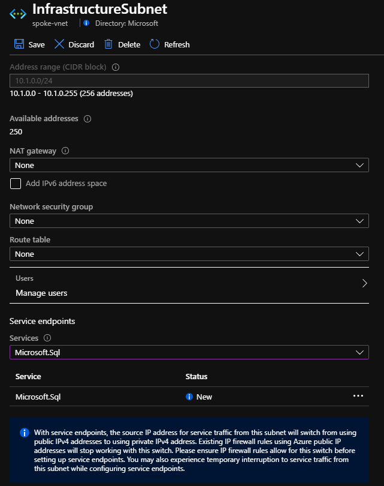

## Task 3: Enable Virtual Network access within SQL Server Firewall

Create a new Virtual Network rule within your SQL Server Firewall allowing access from the InfrastructureSubnet within which your Azure client/mgmt VM resides. Notice how it recognises that you have enabled the service endpoint for Azure.SQL in Task 1 - "service endpoint status = enabled".

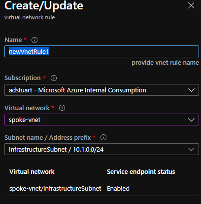

Now verify that you are still able to connect to your SQL server via SSMS.

## :checkered_flag: Results

- Your SQL Server is no longer accepting connections from any Public IP address. It only accepts connections from your specific Subnet where service endpoints are enabled. 

### :point_right: Hint 

**Even with service endpoints enabled, we are still sending destination traffic to the Public Interface of our SQL Server. The difference is how the traffic is sourced; now utilising a special "VNET:Subnet" tag, rather than the Public IP address in Step 1**

# Challenge 3 : Deploy a Private Endpoint to utilise Azure Private Link for access to Azure SQL

### Goal

In order to access your SQL Server via its "Private interface" we need to setup a new Private Endpoint and map this to your specific server. This will allow us to access the SQL server from your client/mgmt VM, whilst retaining the use of setting "deny public access".

## Task 1 : Setup Private Endpoint

- Search for Private Link in the portal and click on "create private endpoint".
- Use your spoke resource-group and give it a name such as PE-SQL
- Within step 2 "resource" we choose which PaaS service we want to point our Private Endpoint at. Look within your directory to find your SQL Server (use resource type microsoft.sql/servers and sub-resource sqlServer)
- Within step 3 "configuration" we choose where to place your Private Endpoint NIC. Place it within the same InfrastructureSubnet as your VM, this will be the default. 
- Leave the Private DNS Integration at the default "yes". More on this later.

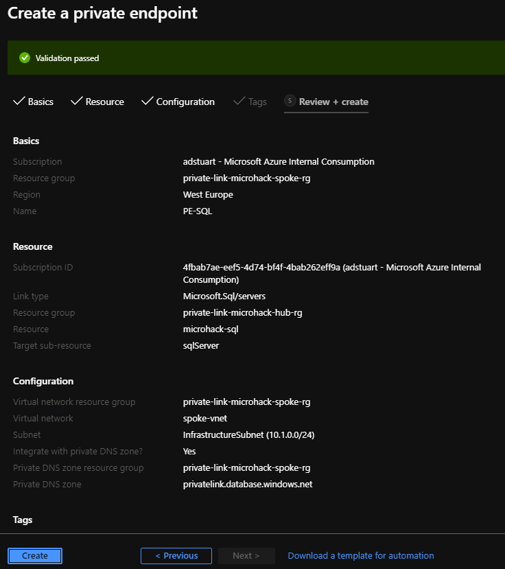

## Task 2: Observe deployed resources and functions

Once deployed you now have some new resources in your spoke resource group:

- A **Private Endpoint** named something like PE-SQL. Notice how it obtains an IP dynamically (10.1.0.5). Also notice how it has been auto-approved on the provider side (this happened because you have the appropriate RBAC rights on the SQL Server). If you did not, for example the SQL server you were trying to connect to was within another Azure AD tenant, the service owner would be asked to approve connectivity on their side.
- An **Azure DNS Private Zone** for privatelink.database.windows.net. This was automatically created for you as part of the portal experience for Private Endpoints. Have a look within this resource and notice how you have an A record mapping your PE IP of 10.1.0.5 to your SQL Server FQDN. Click on Virtual Network Links and observe how this zone is linked to your Spoke Virtual Network.
- A new **Private endpoint connection** is now visible within a blade of the same name, within your SQL Server settings (one below Firewall and Virtual Networks). Notice how, as the service owner, you can reject or remove this connection if desired.

## Task 3: Test private connectivity via your Private Endpoint

Back on your client/mgmt VM, re-run the nslookup command you used earlier to check what IP address is being used by your SQL server. Notice how the DNS lookup now returns a Private IP address, and not a Public IP.

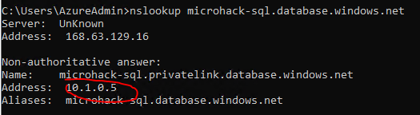

Re-connect using SSMS and ensure access is working again.

## :checkered_flag: Results

- You have connected to your SQL server via a new Private Endpoint
- Your SSMS connection is still using the same FQDN <database-name>.database.windows.net, no client changes were required. However your Azure DNS Private Zone is defined for <database-name>.**privateliink**.database.windows.net. How is this re-direct happening? Pay close attention to the output of your nslookup command earlier.
 - Notice how an Azure DNS Private Zone was deployed for you, and automatically setup with the correct A record and VNet link. Would the same thing happen if using AZ CLI or Powershell to deploy your Private Endpoint? If not, what would be required?
 
# Challenge 4 : Deny public access to Azure SQL Server

### Goal

In this step we will block all inbound access to your SQL Server on its public interface. This means that any existing Firewall rules (Public IP or Virtual Network) will fail to work. To be clear **this prevents any access from a public IP address, or use of service endpoints; I.e. the Virtual Network link you added to the SQL firewall is now no longer active. With this setting toggled "on", you can only use private endpoints to access your service**

Further reading on this step

https://docs.microsoft.com/en-us/azure/azure-sql/database/connectivity-settings#deny-public-network-access
 
## Task 1 :  Turn off Public access

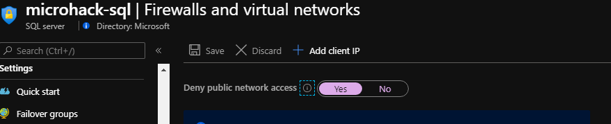

## :checkered_flag: Results

- You have blocked all public access. 
 
# Challenge 5 : Work with a custom DNS server inside of Azure

### Goal 

In the previous challenge we successfully used Azure Private Link and Azure DNS Private Zones to connect in a secure way to our SQL server. This was possible, as the Azure DNS Private Zone was linked directly to the spoke Virtual Network. The Spoke Virtual network has the default DNS settings; sending all DNS requests by default to Azure DNS via the special 168.63.129.16 address. More on that here https://docs.microsoft.com/en-us/azure/virtual-network/what-is-ip-address-168-63-129-16. 

However, the previous challenge was not reflective of a real-world configuration for lots of customers. Many Azure network designs use a custom DNS solution such as customer manged DNS running on top of an IaaS Virtual Machine (or more likely a pair of VMs) hosted in the Azure VNet. In this challenge we will alter our Spoke VNet to utilise our custom DNS server inside of the Azure VNet; a Windows Server 2019 VM running Microsoft DNS. We will also ensure we retain access to our SQL Server and that the DNS response continues to include the use of our Private Endpoint IP address.

## Task 1 : Change Spoke VNet DNS settings

Update the Spoke VNet custom DNS settings to point at your DNS Server VM inside of the Hub VNet. In a production deployment this would typically consist of a pair of VMs, for our lab we only have a single VM.

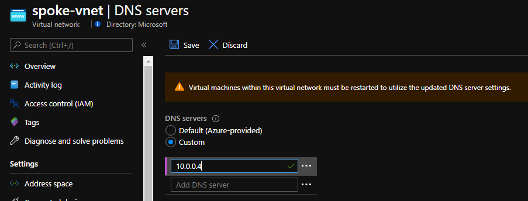

**Reboot** your Azure client/mgmt VM so that it picks up the new DNS settings.

Re-run your nslookup command to check the IP address returned for your SQL Server. Notice how the DNS server used is now 10.0.0.4, but the A record returned has now regressed to using the public VIP of SQL. Access will not work in this configuration as you are not utilising your Private Endpoint.

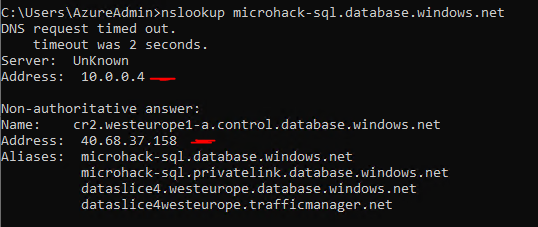

Why has this happened if your Azure DNS private zone is still in place?

## Task 2 : Modify Azure DNS Private Zone

Your Azure DNS Private Zone is only linked to your Spoke VNet. However, your Spoke VNet is now sending its requests for DNS to the DNS Server inside of your Hub VNet. This in turn is configured to query Azure DNS. As your Azure DNS Private Zone is not linked to your Hub VNet, requests from this VNet utilise only the records held within the Public Zones. Let's change that by swinging the Virtual Network link over from your Spoke VNet, to your Hub VNet.

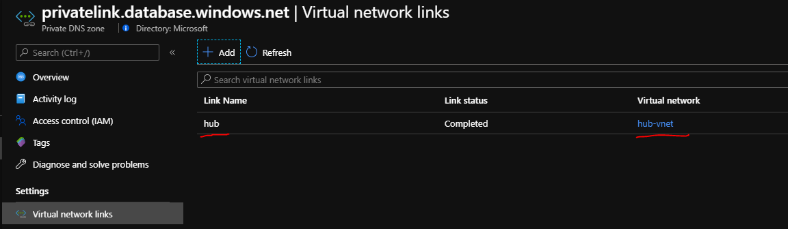

## Task 3 : Add conditional forwarder to DNS Server VM in Azure

Your custom DNS server inside of Azure consists of a standard Windows Server 2019 VM, with the DNS role enabled. The default configuration of this is to send all unknown DNS requests to something called Root Hints (A known collection of servers on the Internet that can be used for public DNS lookups). You can verify this via logging in to the VM and looking at the server properties in DNS Manager.

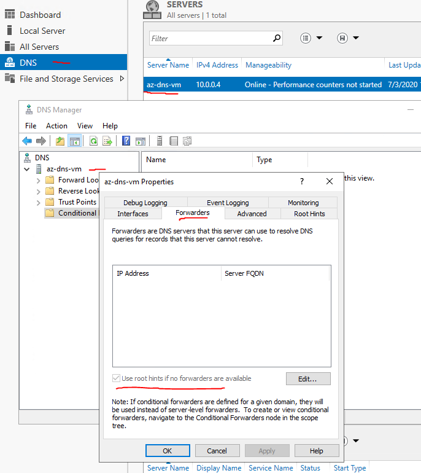

This means that DNS requests from our Azure client/mgmt VM are being forwarded to our DNS Server, and then on to public Root Hints server(s) located on the public Internet. (You can see these server details within the Root Hunts tab if interested). Unfortunately, whilst this is great for enabling a Microsoft DNS Server to function with its default config, it also means that requests are not being sent to Azure DNS (via the special 168 address mentioned earlier), and therefore our use of Azure DNS Private Zones is failing.

We could fix this in one of two ways. Either by enabling a specific forwarder (known as conditional forwarding in DNS) to our database.windows.net zone, or we can just tell our server to forward all requests to Azure DNS by default. We will dig in to the former as part of a later challenge, so let's go with the easier option of updating our global forwarder within DNS Manager to point at Azure DNS.

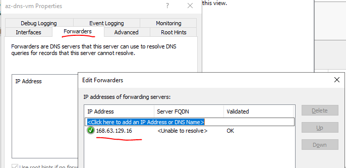

## Task 4: Verify

Verify:

- Clear the DNS cache on your Azure client/mgmt VM via 'ipconfig /flushdns'. 
- Clear the DNS cache on your Azure DNS server VM. (Connect via RDP, browse DNS Manager, right-click server name 'clear cache')
- Re-run nslookup on the client/mgmt VM in Azure to ensure the Private IP is once again being returned, and you can browse via SSMS, proving that Private Link is operational

## :checkered_flag: Results

- You are now using Azure Private Link to access your SQL server alongside the use of a custom DNS server inside of Azure. DNS requests from your client/mgmt VM within the Spoke VNet are being sent via the Microsoft Windows Server inside of your Hub VNet. This server is configured to send all unknown requests to Azure DNS.

# Challenge 6 : Use Private Link to access an Azure SQL Server over a Private Hybrid Connection

### Goal

The goal of this exercise is to show how Private Link can be used to access an Azure PaaS service over a private hybrid connection. This could be either an ExpressRoute Private Peering or a Site-to-site VPN. In our lab we use the latter for ease of deployment. This is a core benefit of Private Link and in high demand by customers, as it enables access to PaaS services on a Private IP address from On-Premises locations, as opposed to via a Public Interface which would typically traverse the Public Internet (Or ExpressRoute Microsoft Peering if that is in place).

## Task 1 :  Consider hybrid topology and expected packet flow 

We already verified as part of the MicroHack pre-requisites that our On-Premises network can access our Azure environment (the fact that your RDP access works also proves this!). Therefore, at a basic Layer-3 network level we have access from our On-Premises VM to the IP address of our Private Endpoint in the Spoke VNet.

However, the complexity of On-Premises use of Private Endpoints is not one of network routing, but more one of DNS. Our On-Premises DNS server (which our On-Premises client is configured to use) sends all unknown requests out to the Internet (8.8.8.8). This is typical of an On-Premises DNS server within a company's Data Centre, either using Public DNS servers or the DNS server from their incumbent Internet Service Provider (ISP). Re-visit the topology diagram at the start of the Micro Hack to see this configuration in visual format.

As we discovered in Challenge 4, we need to modify our DNS requests in order to use Private Link. The same applies to On-Premises traffic, but the challenge is made more difficult by one key consideration: **Your On-Premises DNS server does not live in Azure! (Well it does in this lab, but let's ignore that ;-) ). Due to this, it cannot query the special 168.63.129.16 address; this only exists within Azure, and can only be queried by compute entities living on an Azure Host.**

We therefore need to modify our On-Premises DNS configuration to only forward certain requests (for the PaaS services we are using Private Link for) to something that lives in our Azure Virtual Network, which in turn can "proxy" these requests on to Azure DNS via the special 168 address. Luckily for us, and most customers, we have something that is listening for DNS requests in our VNet; our Hub DNS Server with IP address 10.0.0.4!

## Task 2 :  Verify default behaviour or On-Premises client/mgmt VM

Run a quick nslookup from your client/mgmt VM on-premises, and notice that it receives back the public IP for your SQL server. Also note the DNS server being used (192.168.0.4 - the On-Premises DNS Server in your topology).

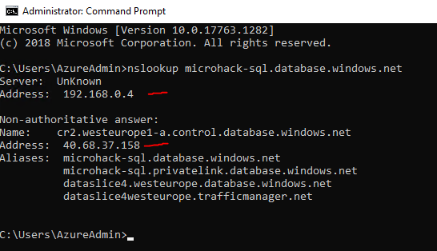

## Task 3 :  Setup conditional forwarder

- Login to your On-Premises DNS Server and open DNS Manager. 
- Observe the global forwarder for 8.8.8.8.
- Configure a new conditional forwarder for database.winodws.net pointing at your Azure DNS Server (10.0.0.4)

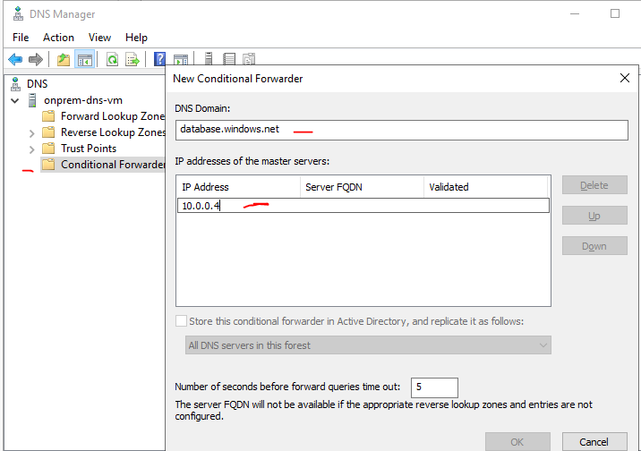

Your On-Premises DNS Server is now configured to forward all unknown requests to 8.8.8.8, but has a more specific condition to forward requests matching *.database.windows.net* to 10.0.0.4; the IP address of your Azure DNS server, reached via the Site-to-Site VPN. Further reading on this specific subject: https://github.com/dmauser/PrivateLink/tree/master/DNS-Integration-Scenarios#41-which-conditional-forwarder-zone-should-be-used. 

## Task 4: Verify

Verify:

- Clear the DNS cache on your On-Premises client/mgmt VM via 'ipconfig /flushdns'. 
- Clear the DNS cache on your On-Premises DNS server. (Connect via RDP, browse DNS Manager, right-click server name 'clear cache')
- Re-run nslookup on the client/mgmt VM in Azure to ensure the Private IP is once again being returned, launch SSMS and ensure you are able to access your SQL Server.

## :checkered_flag: Results

- You are now using Azure Private Link to access your SQL server from On-Premises, entirely via your privately IP addressed Hybrid Site-to-Site VPN Connection. You have modified your DNS configuration to make this work, as depicted in the packet walk diagram below.

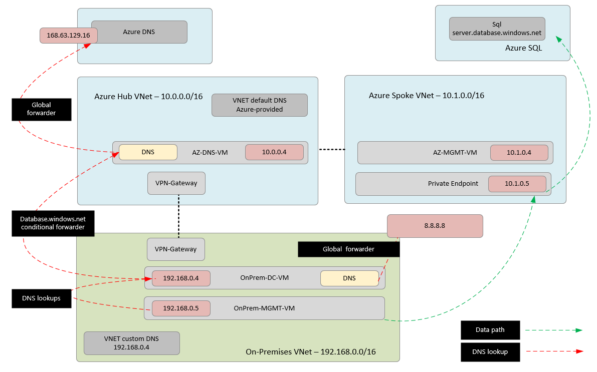
 
# Challenge 7 : (Warning! Stretch Goal / Advanced) Use Private Link from On-Premises without a pre-existing DNS Server in Azure

### Goal

What would happen if you were given Challenge 6 but did not have an existing DNS Server inside of Azure? How would you proxy DNS requests to the 168 address? In this challenge we will introduce two solutions to this problem. This is for customers that do not have existing IaaS DNS servers inside of Azure to perform this DNS request proxy function.

### :point_right: Hint 

**These advanced tasks are left open ended on purpose, without solutions, to solicit group discussion.**

## Option 1 :  Utilise advanced features of Azure Firewall to proxy DNS requests

Perhaps you do not have DNS Servers inside of Azure, but you **do** have an Azure Firewall deployed. Have a look at one of the new features of Azure Firewall and consider how this could be used in place of our Hub VNet DNS Server.

https://docs.microsoft.com/en-us/azure/firewall/dns-settings
 
Note this feature is currently in public preview.

## Option 2 :  Deploy a light-weight highly-available DNS proxy based on NGINX

https://github.com/microsoft/PL-DNS-Proxy
 
# Finished? Delete your lab

- Open your Azure Cloud Shell and go to the folder ./privatelink-dns-microhack and run the following command

`terraform destroy`

- Remove the remaining resources by deleting the resource group private-link-microhack-spoke-rg

Thank you for participating in this MicroHack!

